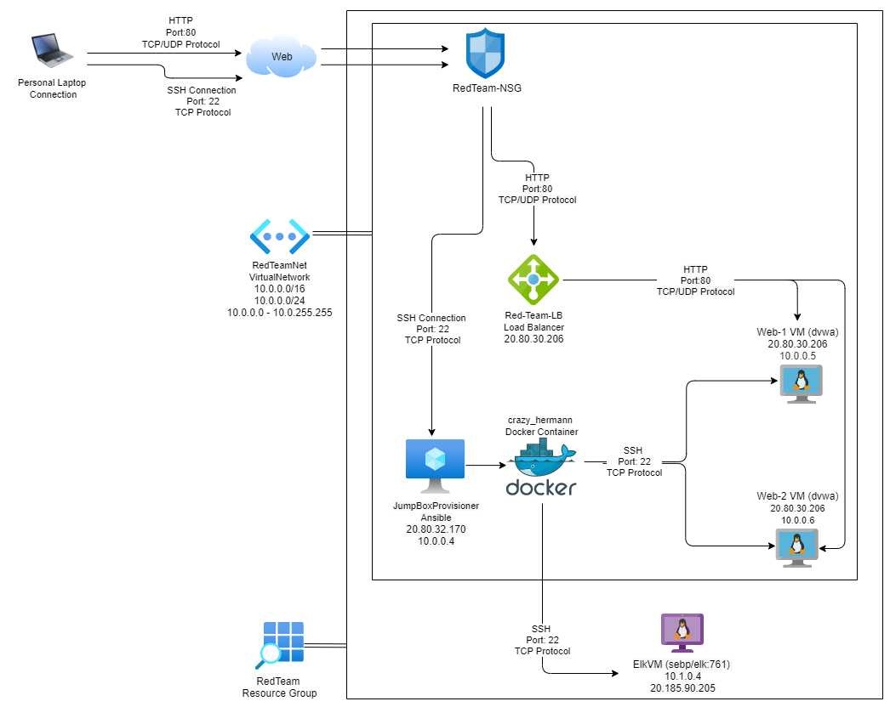
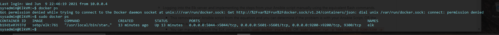

## Automated ELK Stack Deployment

The files in this repository were used to configure the network depicted below.

These files have been tested and used to generate a live ELK deployment on Azure. They can be used to either recreate the entire deployment pictured above. Alternatively, select portions of the [Resources/ansible] file may be used to install only certain pieces of it, such as Filebeat.

  -  
  - 

This document contains the following details:
- Description of the Topologu
- Access Policies
- ELK Configuration
  - Beats in Use
  - Machines Being Monitored
- How to Use the Ansible Build

### Description of the Topology

The main purpose of this network is to expose a load-balanced and monitored instance of DVWA, the D*mn Vulnerable Web Application.

Load balancing ensures that the application will be highly reliable, in addition to restricting access.
- Load Balancers not only ensure the integrity and reliability of a system, the also provide a layer of protection from protecting against threats, such as DDoS attacks. 
- The advantage of having a JumpBox is that you have a secured point of access into the system that can be monitored or reconfigured at any time. 

Integrating an ELK server allows users to easily monitor the vulnerable VMs for changes to the Ansible JumpBox and system network.
- Filebeat looks for and collects log events from the specified locations, then forwards those ogs to Kibana
- Metricbeat rocords statistics of the specified locations and forwards that data to Kibana.

The configuration details of each machine may be found below.
_Note: Use the [Markdown Table Generator](http://www.tablesgenerator.com/markdown_tables) to add/remove values from the table_.

| Name     | Function | IP Address | Operating System |
|----------|----------|------------|------------------|
| Jump Box | Gateway  | 10.0.0.4   | Linux (ubuntu)   |
| Web-1    | Websever | 10.0.0.5   | Linux (ubuntu)   |
| Web-2    | Websever | 10.0.0.6   | Linux (ubuntu)   |
| ElkVM    | Elk      | 10.1.0.4   | Linux (ubuntu)   |

### Access Policies

The machines on the internal network are not exposed to the public Internet. 

Only the JumpBoxProvisioner machine can accept connections from the Internet. Access to this machine is only allowed from the following IP addresses:
- 71.239.83.121

Machines within the network can only be accessed by the JumpBoxProvisioner machine.
- The only machine can communnicate with the ElkVM is the Jumpbox Machine. The IP for this machine is 10.0.0.4 / 20.80.32.170

A summary of the access policies in place can be found in the table below.

| Name     | Publicly Accessible | Allowed IP Addresses |
|----------|---------------------|----------------------|
| Jump Box | Yes                 | 71.239.83.121        |
| Web-1    | No                  | 10.0.0.4, 10.0.0.6   |
| Web-2    | No                  | 10.0.0.4, 10.0.0.5   |

### Elk Configuration

Ansible was used to automate configuration of the ELK machine. No configuration was performed manually, which is advantageous because...
- The main advantage of automating this process with ansibe is that it not only saves time, it also allows you to deploy and redeploy the environments onto multiple machines with ease and percision.

The playbook implements the following tasks:
- It first installs the docker cotainer on the machine along with the modules and services needed to run.
- It then gives a name to the container and instructs which ports will be communicated over.
- Finally it 

The following screenshot displays the result of running `docker ps` after successfully configuring the ELK instance.

### Target Machines & Beats
This ELK server is configured to monitor the following machines:
- Webserver 1: 10.0.0.5
- Webserver 2: 10.0.0.6

We have installed the following Beats on these machines:
- Filebeat
- Metricbeat

These Beats allow us to collect the following information from each machine:

- Filebeat captures log data and events from locations specified by the user, which then are stored and acessable from a centralized point of collection. Similarly Metricbeat collects data from the machine, however the data this beat collects is statistics about the machine(s) specified, giving a visual output of this data though an online interface.

### Using the Playbook
In order to use the playbook, you will need to have an Ansible control node already configured. Assuming you have such a control node provisioned: 

SSH into the control node and follow the steps below:

- Copy the install-elk.yml file to /etc/ansible/

- Update the /etc/ansible/hosts file to include a group under [webservers], called [elk]. In this group liste the IP of the ElkVM (10.1.0.4)

- Run the playbook, and navigate to [http://20.185.90.205:5601/app/kibana] to check that the installation worked as expected.

(Recap of using the playbook.)

- The playbook is the install-elk.yml file. This file you are going to move into the /etc/ansible/ directory

- You then edit the /etc/ansible/hosts file to specify a new group called [elk]. It is in this group that you will provide the private IP of the ElkVM.
Through having 2 groups of machines [webservers] [elk], you can then specify in the Filebeat/Metricbeat configuration file which machines it is deployed onto.
- [http://20.185.90.205:5601/app/kibana] is the address you will navigate to through a browser on your personal machine. If you can connect successfully, you installation has worked. The address [20.185.90.205] is the public address of the ElkVM, while the [5601] is the port in which it is communicating through.

Commands the user will need to run to download the playbook, update the files, etc._

# To download playbook
- sudo docker pull sebp/elk

# Manually start Elk
- sudo docker-compose up elk

# From the elk VM to list containers 
- sudo docker ps

# Download Metricbeat Configuration File.
curl https://gist.githubusercontent.com/slape/58541585cc1886d2e26cd8be557ce04c/raw/0ce2c7e744c54513616966affb5e9d96f5e12f73/metricbeat > /etc/ansible/metricbeat-config.yml

# Install Metricbeat.
- ansible-playbook metricbeat-playbook.yml

# Download Filebeat Configuration File.
curl https://gist.githubusercontent.com/slape/5cc350109583af6cbe577bbcc0710c93/raw/eca603b72586fbe148c11f9c87bf96a63cb25760/Filebeat > filebeat-config.yml

# Install Filebeat.
- ansible-playbook filebeat-playbook.yml

## Copy files from container to VM
sudo docker cp 3af1dbd241c6:/etc/ansible/ /home/azureuser

## Copy files from VMm to local Machine
scp -r azureuser@20.80.32.170:~/ansible Desktop

## SSH Key-Gen
ssh key-gen
cat ~/.ssh/id_rsa.pub